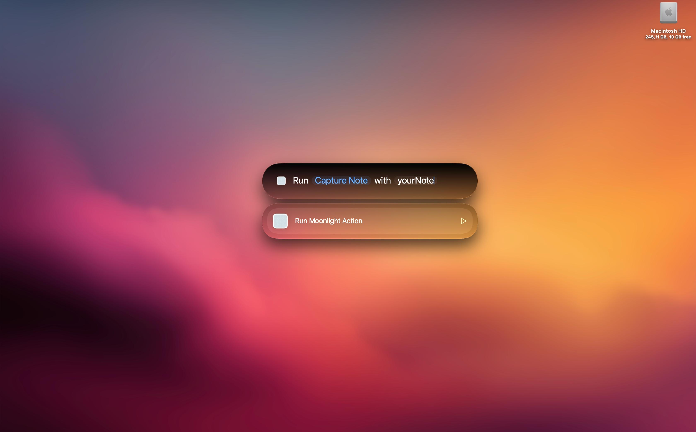

# Moonlight

Moonlight é um conjunto de ações rápidas para o macOS, acessíveis pelo Spotlight e Shortcuts integrado ao framework App Intents com o SDK beta da Apple para o macOS 27 Golden Gate.

Por enquanto é um teste de levar as capacidades do Spotlight/Siri ao limite e juntar com a suíte de mudanças interessantes para powerusers/devs do framework App Intents. Caso o teste seja bem-sucedido, existe a possibilidade de port para iOS 27.

## Licença

PolyForm Noncommercial License 1.0.0. Consulte [LICENSE.md](LICENSE.md).

## Release

Pré-alpha `0.1.0-pre-alpha.2` — build `8`.
